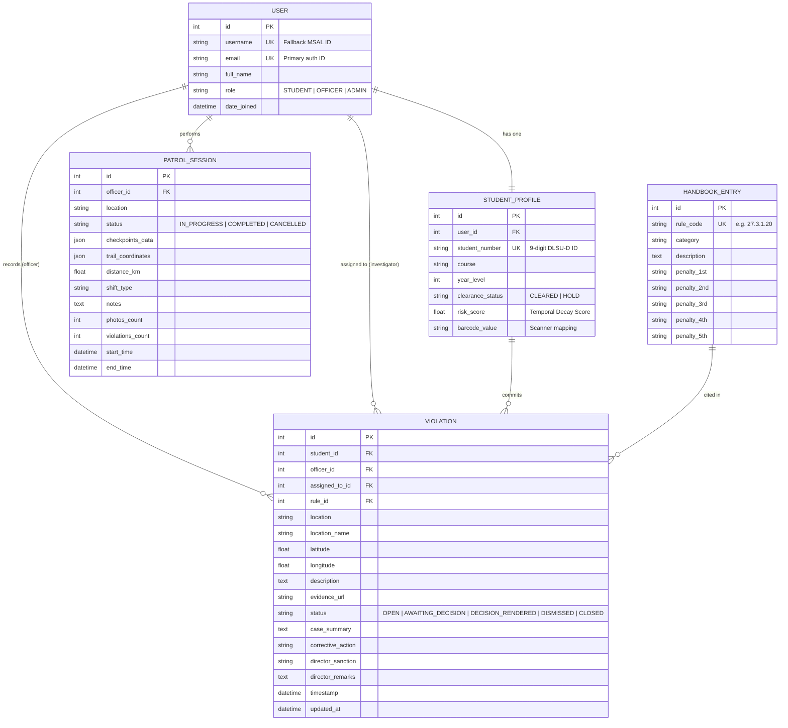

# Database Documentation — SWAFO Institutional Portal
**Version:** 2.0 (Defense Ready)  
**System:** Standalone SWAFO Web Application for Violation Management  
**Backend Framework:** Django 6.0 + PostgreSQL  

---

## 1. Entity Relationship Diagram (ERD)

---

## 2. Table Catalog (Django Models)

### 2.1 Table: `User` (extends AbstractUser)
Stores authentication and identity data for all portal users.

| Field | Type | Attributes | Description |
|---|---|---|---|
| `username` | CharField(150) | unique, blank, null | Fallback identifier for MSAL compatibility |
| `email` | EmailField | unique | Primary authentication identifier |
| `full_name` | CharField(255) | blank | Display name |
| `role` | CharField(20) | choices, default='STUDENT' | Role-based access control. Choices: `STUDENT`, `OFFICER`, `ADMIN` |

### 2.2 Table: `StudentProfile`
Extended data for students, used for violation mapping, risk scoring, and barcode identification.

| Field | Type | Attributes | Description |
|---|---|---|---|
| `user` | OneToOneField | on_delete=CASCADE | Link to User model (`related_name='student_profile'`) |
| `student_number` | CharField(9) | unique, RegexValidator | 9-digit DLSU-D student ID |
| `course` | CharField(100) | | College/program (e.g., "BS Computer Science") |
| `year_level` | IntegerField | default=1 | 1–4 |
| `clearance_status` | CharField(20) | choices, default='CLEARED' | Director Oversight. Choices: `CLEARED`, `HOLD` |
| `risk_score` | FloatField | default=0.0 | Temporal Decay Score (computed, 0–100) |
| `barcode_value` | CharField(255) | blank, null | Future barcode mapping for ID scanning |

### 2.3 Table: `HandbookEntry` (Section 27)
The central reference for all university rules and mandated penalties.

| Field | Type | Attributes | Description |
|---|---|---|---|
| `rule_code` | CharField(20) | unique | e.g., "27.3.1.20" |
| `category` | CharField(100) | | Minor Rule 27.1 / Major Rule 27.3 / Traffic — Minor / Traffic — Major |
| `description` | TextField | | Full rule text |
| `penalty_1st–5th` | CharField(255) | blank, null | Escalating penalty tiers |

### 2.4 Table: `Violation` (Incidents)
Records of actual infractions logged by Officers.

| Field | Type | Attributes | Description |
|---|---|---|---|
| `student` | ForeignKey | on_delete=CASCADE | Offending student (`related_name='violations'`) |
| `officer` | ForeignKey | on_delete=SET_NULL, null | Recording officer (`related_name='recorded_violations'`) |
| `assigned_to` | ForeignKey | on_delete=SET_NULL, null, blank | Assigned investigator (`related_name='assigned_violations'`) |
| `rule` | ForeignKey | on_delete=PROTECT | Cited handbook rule (`related_name='violations'`) |
| `location` | CharField(255) | | Free-text location |
| `location_name` | CharField(255) | blank | Normalized key (matches DLSUD_LOCATIONS) |
| `latitude, longitude`| FloatField | blank, null | GPS coordinates (auto-populated from lookup) |
| `description` | TextField | | Officer's written statement |
| `evidence_url` | URLField | blank, null | Photo/file evidence link |
| `status` | CharField(20) | choices, default='OPEN' | Lifecycle status. Choices: `OPEN`, `AWAITING_DECISION`, `DECISION_RENDERED`, `DISMISSED`, `CLOSED` |
| `case_summary` | TextField | blank | AI-generated incident summary |
| `corrective_action`| CharField(255) | blank | System-recommended penalty |
| `director_sanction`| CharField(255) | blank, null | Formal sanction (Director only) |
| `director_remarks` | TextField | blank, null | Director's justification |
| `timestamp` | DateTimeField | auto_now_add=True | Auto-set on creation |
| `updated_at` | DateTimeField | auto_now=True | Auto-set on save |

### 2.5 Table: `PatrolSession`
Tracking officer surveillance activity across campus.

| Field | Type | Attributes | Description |
|---|---|---|---|
| `officer` | ForeignKey | on_delete=CASCADE | Patrolling officer (`related_name='patrols'`) |
| `location` | CharField(255) | | Patrol area name |
| `start_time` | DateTimeField | auto_now_add=True | Session start timestamp |
| `end_time` | DateTimeField | blank, null | Session end timestamp |
| `status` | CharField(20) | choices, default='IN_PROGRESS' | Lifecycle. Choices: `IN_PROGRESS`, `COMPLETED`, `CANCELLED` |
| `checkpoints_data` | JSONField | blank, default=list | Array of checkpoint objects |
| `trail_coordinates`| JSONField | blank, default=list | Array of [lng, lat] GPS breadcrumbs |
| `distance_km` | FloatField | default=0.0 | Total km traveled (Haversine) |
| `shift_type` | CharField(50) | blank, null | Morning / Afternoon / Evening |
| `notes` | TextField | blank, null | Officer notes |
| `photos_count` | IntegerField | default=0 | Evidence photos captured |
| `violations_count` | IntegerField | default=0 | Violations recorded during patrol |

---

## 3. Relationship Notes & Cardinality

1.  **User to StudentProfile (1:1)**: Every student user must have exactly one student profile. Officers and Admins do not have student profiles.
2.  **StudentProfile to Violation (1:N)**: A student can incur multiple violations over their academic stay.
3.  **User (Officer) to Violation (1:N)**: An officer can report multiple violations.
4.  **User (Investigator) to Violation (1:N)**: An investigator can be assigned to multiple violations.
5.  **User to PatrolSession (1:N)**: An officer can perform multiple patrol sessions.
6.  **HandbookEntry to Violation (1:N)**: A specific rule can be cited across multiple violation records.

---

## 4. Institutional Business Rules

*   **Rule 1: Escalation Engine**: When a `Violation` is recorded, the system queries the `Violation` table for the same `student_id` and `rule_id` (or related categories). The offense count determines which penalty tier is selected from the `HandbookEntry` table.
*   **Rule 2: Traffic Exception**: Traffic violations follow an independent frequency table. They cross-pollinate with general Minor offenses on the second instance (Section 27.4.2).
*   **Rule 3: Duplicate Guard**: The system flags the same `rule_id` for the same `student_id` within a 24-hour temporal window to prevent accidental double-reporting during high-volume patrols.
*   **Rule 4: Section 27.3.5 Detection**: Repeated Major offenses of a *different nature* automatically halt normal escalation and trigger a referral directly to the SDAO Director.

---

## 5. Institutional Data Provisioning & Resolution

This system utilizes a **Pre-Provisioned Data Model** to ensure institutional integrity and prevent manual profile errors.

1.  **Data Sourcing**: Student records (Student Number, College, Year Level) are seeded into the `StudentProfile` and `User` tables mimicking the university's Registrar database.
2.  **The Identity Bridge**: The **Email Address** serves as the primary connection point between the Authentication Layer and the Data Layer.
3.  **Authentication Resolution**:
    *   The student authenticates via **Microsoft MSAL SSO** using their institutional account (`@dlsud.edu.ph`).
    *   Upon successful handshake, the system retrieves the verified email (via `preferred_username`).
    *   The backend performs a `User.objects.get(email=ms_email)` query to resolve the internal User ID.
4.  **Automatic Profile Linking**: Once the User identity is resolved, the system traverses the 1:1 Foreign Key to `StudentProfile`, ensuring the student's **Student Number** and **Course** are instantly available globally without manual input.

---

## 6. Optimized Indexes (Planned)

*   `idx_student_number`: High-speed lookup during barcode scanning in the `RecordViolation` flow.
*   `idx_violation_timestamp`: Accelerates the 7-day rolling window analytics and moving average computations on the dashboard.
*   `idx_rule_code`: Enables rapid vector-to-relational bridging for the AI Assistant's semantic search.
