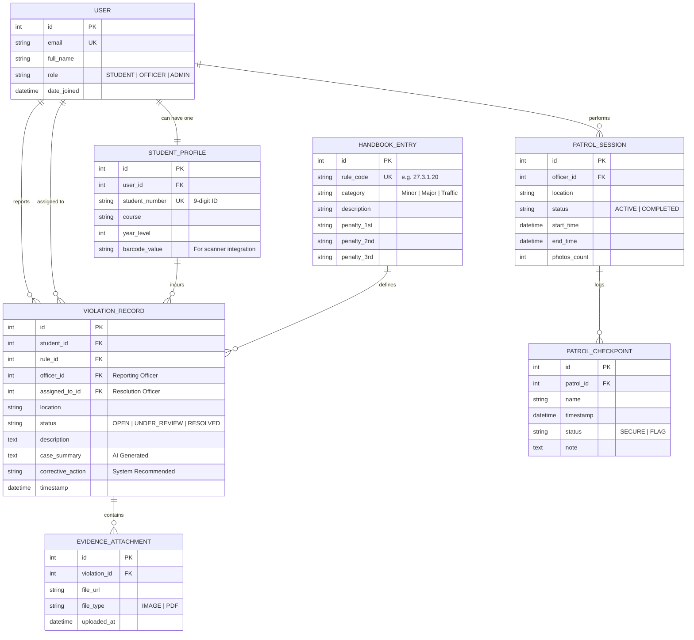

# Database Documentation — SWAFO Institutional Portal
**Version:** 1.0 (Defense Ready)  
**System:** Standalone SWAFO Web Application for Violation Management  
**Backend Framework:** Django + PostgreSQL  

---

## 1. Entity Relationship Diagram (ERD)

---

## 2. Table Catalog

### 2.1 Table: `Users`
Stores authentication and identity data for all portal users.
| Field | Type | Constraints | Description |
|---|---|---|---|
| `id` | BigInt | PK, Auto-increment | Unique system ID |
| `email` | Email | UK, Required | Institutional email (@dlsud.edu.ph) |
| `full_name` | String(255) | Required | Legal name for institutional records |
| `role` | Choice | Required | Defines access level: `STUDENT`, `OFFICER`, or `ADMIN` |
| `is_active` | Boolean | Default: True | User account status |

### 2.2 Table: `StudentProfile`
Extended data for students, used for violation mapping and barcode identification.
| Field | Type | Constraints | Description |
|---|---|---|---|
| `user_id` | ForeignKey | One-to-One (User) | Link to core Auth record |
| `student_number`| String(9) | UK, Regex (9 digits) | Official DLSU-D Student ID |
| `course` | String(100) | Required | e.g., BSCS, BSBA |
| `barcode_value` | String(255) | Nullable, UK | Unique string from student ID barcode |

### 2.3 Table: `HandbookEntry` (Section 27)
The central reference for all university rules and mandated penalties.
| Field | Type | Constraints | Description |
|---|---|---|---|
| `rule_code` | String(20) | UK, Required | Official code (e.g., 27.4.2) |
| `category` | String(100) | Required | Minor, Major, or Traffic (Section 27) |
| `description` | Text | Required | Full text from Student Handbook |
| `penalty_1st` | String(255) | Nullable | Sanction for first offense |
| `penalty_2nd` | String(255) | Nullable | Sanction for second offense (Escalated) |

### 2.4 Table: `Violation` (Incidents)
Records of actual infractions logged by Officers.
| Field | Type | Constraints | Description |
|---|---|---|---|
| `student_id` | ForeignKey | FK (StudentProfile) | The offender |
| `rule_id` | ForeignKey | FK (HandbookEntry) | The specific rule violated |
| `officer_id` | ForeignKey | FK (User) | The officer who recorded it |
| `status` | Choice | OPEN, RESOLVED, etc. | Current lifecycle state |
| `case_summary` | Text | Nullable | AI-generated concise incident summary |
| `corrective_action`| String | Nullable | System-calculated sanction (Section 27) |

### 2.5 Table: `PatrolSession`
Tracking officer surveillance activity across campus.
| Field | Type | Constraints | Description |
|---|---|---|---|
| `officer_id` | ForeignKey | FK (User) | The patrolling officer |
| `location` | String | Required | Campus zone (e.g., East Campus Rotunda) |
| `start_time` | DateTime | Auto-now-add | Session start timestamp |
| `photos_count` | Integer | Default: 0 | Number of evidence photos taken |

---

## 3. Relationship Notes & Cardinality

1.  **User to Student (1:1)**: Every student user must have exactly one student profile. Officers and Admins do not have student profiles.
2.  **Student to Violation (1:N)**: A student can incur multiple violations over their academic stay.
3.  **Officer to Violation (1:N)**: An officer can report multiple violations.
4.  **Patrol to Checkpoint (1:N)**: A single patrol session consists of multiple verification points (stored as JSON in prototype, normalized in production).
5.  **Violation to Evidence (1:N)**: One incident may have multiple photos or documents attached for defense proof.

---

## 4. Institutional Business Rules

*   **Rule 1: Escalation Engine**: When a `Violation` is recorded, the system queries the `Violation` table for the same `student_id` and `rule_id`. The offense count determines which `penalty_X` is selected from the `HandbookEntry` table.
*   **Rule 2: Traffic Exception**: Traffic violations follow an independent frequency table. They only "cross-pollinate" with general Major offenses on the second instance (Section 27.4.2).
*   **Rule 3: Duplicate Guard**: The system prevents logging the same `rule_id` for the same `student_id` within a 24-hour temporal window to avoid accidental double-reporting.
*   **Rule 4: Patrol Integrity**: A patrol session is only considered valid if it contains at least 3 unique timestamps or 1 photo capture.

---

## 5. Institutional Data Provisioning & Resolution

This system utilizes a **Pre-Provisioned Data Model** to ensure institutional integrity and prevent manual profile errors.

1.  **Data Sourcing**: Student records (Student Number, College, Year Level, and Email) are pre-loaded into the `StudentProfile` and `User` tables from the university's Registrar/IT database.
2.  **The Identity Bridge**: The **Email Address** serves as the primary connection point between the Authentication Layer and the Data Layer.
3.  **Authentication Resolution**:
    *   The student authenticates via **Microsoft MSAL SSO** using their institutional account.
    *   Upon successful handshake, the system retrieves the verified email.
    *   The backend performs a `User.objects.get(email=ms_email)` query to resolve the internal `User ID`.
4.  **Automatic Profile Linking**: Once the User identity is resolved, the system automatically pulls the associated `StudentProfile`, ensuring the student’s **Student Number** and **Course** are instantly available without manual input.

---

## 6. Optimized Indexes

*   `idx_student_id`: To quickly load student profile during barcode scanning.
*   `idx_violation_timestamp`: To drive the 7-day rolling analytics dashboard.
*   `idx_rule_code`: To enable high-speed handbook rule lookup for the AI Assistant.

