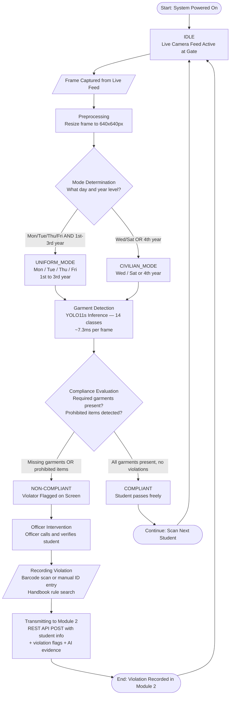

# SWAFO Flowcharts (Standard Flowchart Version)
## AI-Powered Dress Code Detection and Violation Management System for DLSU-D

**De La Salle University - Dasmarinas**
**College of Science and Computer Studies**
**Chapter 3 Supporting Document**

---

## Figure 3.X.1: Flowchart of Module 1 (Dress Code Detection)

This flowchart models the real-time detection cycle of the AI system deployed on a live camera feed at the DLSU-D campus gates. The system runs continuously, analyzing students as they pass through. When a violator is detected, the SWAFO Officer is alerted, calls the student, and manually records the violation, which is then transmitted to Module 2.



---

## Figure 3.X.2: Flowchart of Module 2 (SWAFO Web Application)

This flowchart models the institutional enforcement workflow within Module 2. It covers three parallel processes: the violation case lifecycle from creation to director adjudication, the patrol session lifecycle from route planning to archival, and the student compliance standing update triggered by each recorded violation.

```mermaid
flowchart TD
    START([Start: Violation Received from Module 1 or Officer Portal])
    RECORD[/Input: Student ID + Violation Rule\n+ Photo Evidence + GPS Location/]
    DUPLICATE{Duplicate Check\nSame student + same rule\nwithin 24-hour window?}
    WARN[Warning Modal Shown to Officer\nDiscard or Proceed?]
    DISCARD([End: Draft Discarded])
    ESCALATION[Escalation Engine\nCount prior offenses per category\nApply Section 27 penalty ladder\nCheck cross-category thresholds]
    DECAY[Temporal Decay Risk Scoring\nScore = sum of severity x e^\-0.023 x days\nCapped at 100\nUpdate student risk leaderboard]
    CREATE[Create Violation Record\nStatus set to OPEN\nLinked to student + officer + rule]
    STANDING{Update Compliance Standing\nTotal violations?}
    GOOD[GOOD STANDING\n0 violations]
    OBLIGATION[HAS OBLIGATION\n1 active violation]
    REPEAT[REPEAT OFFENDER\nTotal >= 2]
    PROBATION[PROBATION\nTotal >= 5]

    ESCALATE_Q{Officer escalates\ncase to Director?}
    AWAIT[AWAITING DECISION\nDirector reviews case]
    DIRECTOR_Q{Director decision?}
    DECISION[DECISION RENDERED\nSanction tier 1-4 selected\nDirector remarks written]
    FULFILLED_Q{Sanctions fulfilled\nby student?}
    CLOSED([CLOSED\nCase archived permanently])
    DISMISSED([DISMISSED\nCase voided by Director])

    PORTAL[/Output: Student Portal Updated\nViolation history + risk score\n+ case verdict visible/]
    ANALYTICS[/Output: Analytics Dashboard Updated\n7-day SMA + recidivism patterns\n+ college benchmarking/]

    START --> RECORD
    RECORD --> DUPLICATE

    DUPLICATE -->|Yes - duplicate found| WARN
    DUPLICATE -->|No - new offense| ESCALATION

    WARN -->|Officer discards| DISCARD
    WARN -->|Officer proceeds| ESCALATION

    ESCALATION --> DECAY
    DECAY --> CREATE
    CREATE --> STANDING

    STANDING -->|Total = 0| GOOD
    STANDING -->|1 active violation| OBLIGATION
    STANDING -->|Total >= 2| REPEAT
    STANDING -->|Total >= 5| PROBATION

    GOOD --> ESCALATE_Q
    OBLIGATION --> ESCALATE_Q
    REPEAT --> ESCALATE_Q
    PROBATION --> ESCALATE_Q

    ESCALATE_Q -->|Yes| AWAIT
    ESCALATE_Q -->|No - remains open| PORTAL

    AWAIT --> DIRECTOR_Q
    DIRECTOR_Q -->|Renders decision| DECISION
    DIRECTOR_Q -->|Dismisses case| DISMISSED

    DECISION --> FULFILLED_Q
    FULFILLED_Q -->|Yes| CLOSED
    FULFILLED_Q -->|No - pending| PORTAL

    CLOSED --> PORTAL
    DISMISSED --> PORTAL
    PORTAL --> ANALYTICS
    ANALYTICS --> ([End: Enforcement Cycle Complete])
```

---

### Key Business Rules

**Violation Case:**
- No backward transitions. CLOSED and DISMISSED are permanent terminal states.
- DISMISSED is reachable from OPEN, AWAITING_DECISION, or DECISION_RENDERED.
- Director sanctions and remarks are permanently stored in the database at DECISION_RENDERED.
- Students can only VIEW their case. All status transitions require Director authority.
- Any non-terminal case blocks the student's Section 14 institutional clearance.

**Risk Scoring:**
- The temporal decay score is computed continuously, not stored as a static field.
- Recent offenses are weighted heavier than old ones due to the exponential decay function.
- Students with unresolved cases receive a 1.5x multiplier on their score.

**Compliance Standing:**
- Standing is computed dynamically from violation counts, not stored as a database field.
- Even if all cases are resolved, risk score and offense history remain visible to officers and directors.
