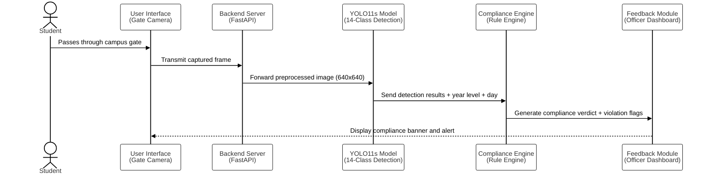

# 3.X.1 Sequence Diagram — Dress Code Compliance Detection (Module 1)

**Figure 3.X: Sequence Diagram of the Dress Code Compliance Detection System**

The sequence diagram presented in Figure 3.X illustrates the end-to-end interaction flow of Module 1, the Dress Code Compliance Detection System, from the moment a student passes the campus gate to the issuance of a compliance verdict. Upon detection of a student at the gate, the IP camera captures a live frame and transmits it to the FastAPI backend. The backend first preprocesses the image, resizing it to the YOLO11s standard input dimension of 640x640 pixels, before forwarding it to the object detection model. The YOLO11s model performs multi-class inference across 14 garment categories and returns a set of bounding box predictions with confidence scores.

The Rule Engine then receives the detection output and determines the applicable compliance mode based on the current day of the week and the student's enrolled year level. In Uniform Mode, the engine verifies the presence of a uniform top, uniform bottom, and proper footwear, and flags any prohibited garment class. In Civilian Mode, it enforces only the prohibited item restrictions. The compliance verdict, along with any violation flags and their corresponding handbook section references, is serialized into a structured JSON report and returned to the frontend, which renders an annotated image with a compliance banner and transmits the violation payload to Module 2 for formal recording if a non-compliant status is detected.

