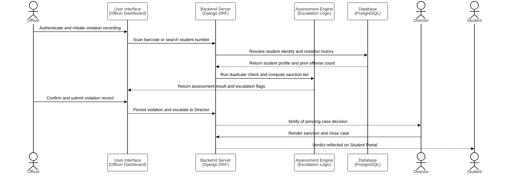

# 3.X.2 Sequence Diagram — Violation Recording and Case Adjudication (Module 2)

**Figure 3.X: Sequence Diagram of the Violation Recording and Case Adjudication System**

The sequence diagram presented in Figure 3.X illustrates the complete institutional workflow of Module 2, the SWAFO Web Application, from officer authentication through to Director adjudication and student notification. The flow is initiated when an officer authenticates via their pre-registered credentials and navigates to the violation recording interface. Student identity is resolved either through a physical barcode scan of the institutional ID or through a manual student number search, both of which query the StudentProfile database to auto-populate the student's full academic record.

Once the student is identified, the officer selects the applicable handbook rule using the hybrid semantic search engine, which performs a combined vector space and lexical query across all 82 encoded rules. Prior to submission, the system's Assessment Engine evaluates the record against two automated checks: a 24-hour duplicate detection window and a full violation history query to determine the appropriate sanction tier and escalation flags. If the escalation engine determines that a cross-category major offense condition under Section 27.3.5 is met, the case is automatically flagged for Director referral, disabling the automated penalty recommendation. Upon submission, the case enters the five-status lifecycle and awaits administrative action. The Director renders a formal sanction decision, which is then persisted to the database and reflected in the student's portal.

