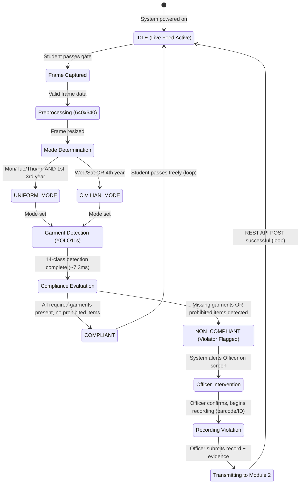
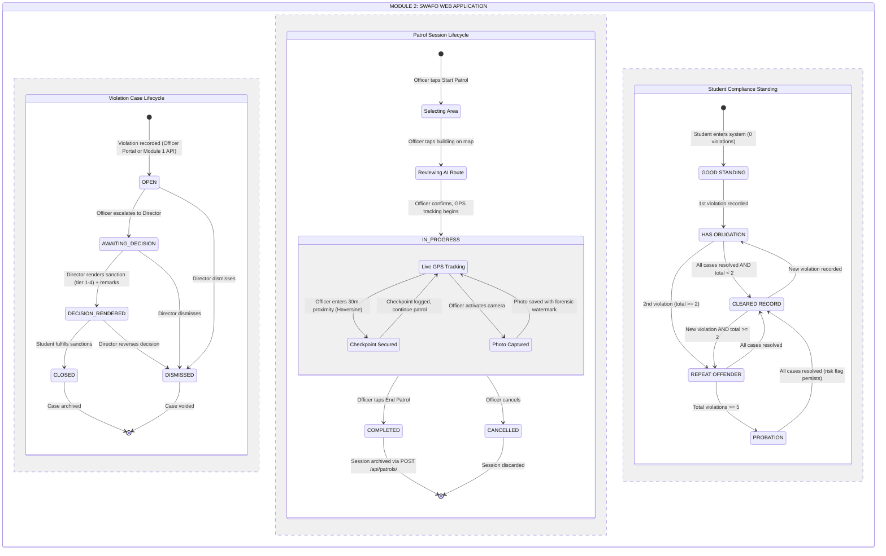

# State Diagram
## SWAFO: An AI-Powered Dress Code Detection and Violation Management System for DLSU-D

**De La Salle University - Dasmarinas**
**College of Science and Computer Studies**
**Chapter 2 Supporting Document**

---

## Figure 3.X.1: State Diagram of Module 1 (Dress Code Detection)

This state diagram models the real-time detection cycle of the AI system deployed on a live camera feed at the DLSU-D campus gates. The system runs continuously, analyzing students as they pass through. When a violator is detected, the SWAFO Officer stationed at the gate is alerted, calls the student, and manually records the violation, which is then transmitted to Module 2.

### Key Points
- The AI does NOT auto-transmit violations to Module 2. It only flags violators on screen.
- The Officer is always the bridge. The Officer decides to call the student, verifies, and records the violation manually.
- The system runs in a continuous loop. After each student (compliant or not), it returns to IDLE and scans the next student.

---

## Figure 3.X.2: State Diagram of Module 2 (SWAFO Web Application)

This state diagram models the three concurrent lifecycles within Module 2: the violation case lifecycle (from creation to closure), the patrol session lifecycle (from route selection to archival), and the student compliance standing (computed dynamically from violation counts). These three lifecycles are presented as parallel regions within a single composite state diagram because they operate simultaneously and influence each other. A recorded violation during a patrol updates both the case lifecycle and the student's compliance standing.

### Key Business Rules

**Violation Case Lifecycle:**
- No backward transitions. A case can never revert from CLOSED back to OPEN. Terminal states are permanent.
- DISMISSED is reachable from any active state. The Director can dismiss at OPEN, AWAITING_DECISION, or DECISION_RENDERED.
- Director sanctions persist. When DECISION_RENDERED, the director_sanction and director_remarks fields are permanently stored in the database.
- Students cannot change case status. They can only VIEW their case verdict and sanctions via the Student Portal. All status transitions require Director authority.
- Clearance blocking. Any case not in a terminal state (CLOSED or DISMISSED) blocks the student's Section 14 institutional clearance.

**Patrol Session Lifecycle:**
- IN_PROGRESS is a composite state containing live GPS tracking, trail rendering, checkpoint monitoring, camera readiness, and violation recording.
- Checkpoints auto-trigger when the officer enters 30m proximity of a designated location, computed via the Haversine formula.
- Photos are forensically watermarked with location name, timestamp, and GPS coordinates via HTML5 Canvas pixel buffer flattening.
- COMPLETED generates a dynamic summary with duration, distance (km), trail coordinates, violations recorded, and photos captured.

**Student Compliance Standing:**
- Standing is computed, not stored. The student's standing label is dynamically computed from their violation counts, not a database field.
- Temporal decay risk score persists even if a student reaches CLEARED RECORD. The score (severity x e^(-0.023 x days)) is always visible to officers and directors.
- Clearance blocking. Any student in HAS OBLIGATION, REPEAT OFFENDER, or PROBATION with active cases cannot obtain Section 14 institutional clearance.
- Director clearance override. Independent of computed standing, the Director can manually set clearance_status = HOLD to block clearance for any student.
