# 3.5.1 System Architecture

**Figure 3.5.1: Unified System Architecture of the SWAFO Violation Management System**

The system architecture of the SWAFO Intelligent Violation Management System is structured into eight functional layers designed to process data from initial capture to administrative resolution. The Frontend Layer acts as the primary data ingress, utilizing IP cameras for real-time video feeds alongside a React-based web dashboard and mobile scanner for officer interactions. Access is secured through the Authentication Layer, which enforces strict role-based controls using Microsoft MSAL SSO for student identity resolution and token-based SimpleJWT for administrative operations. These client requests are routed to the Backend Layer, where a decoupled FastAPI service handles computationally heavy computer vision tasks while a Django REST Framework API manages institutional data and application state.

Before core evaluation, the Preprocessing Layer normalizes the ingested data through frame extraction, image resizing, and GPS jitter filtering to ensure consistent inputs. This feeds directly into the Detection and Inference Layer, where a YOLO11s object detection model identifies 14 distinct garment classes, while a Haversine proximity algorithm and Gemini-powered hybrid semantic search process spatial and contextual data. The extracted intelligence is then evaluated by the Compliance and Assessment Layer. Here, a programmatic rule engine cross-references the detected garments against the student's schedule and the 82-rule disciplinary framework, actively tracking minor offense frequencies and triggering automated escalations for habitual or cross-category violations.

The results of these assessments are surfaced through the Feedback and Output Layer, which provides real-time gate alerts, officer dashboard prompts, and dynamic PDF reports for institutional oversight. Finally, all operations are persisted and enhanced within the Data and AI Layer. A relational PostgreSQL database maintains the integrity of student records and enforcement logs, while Mapbox GL provides geospatial visualization for patrol heatmaps and the Gemini API supports natural language interactions via the student chatbot.

## Mermaid Diagram

```mermaid
flowchart TB
    classDef layerLabel fill:none,stroke:none,color:#000,font-weight:bold,font-size:14px;
    classDef pinkPill fill:#d794b6,stroke:#fff,stroke-width:1px,color:#000,font-weight:bold;
    classDef backendCircle fill:#fff,stroke:#333,stroke-width:2px,color:#000,font-weight:bold;
    classDef dbCylinder fill:#e8e8e8,stroke:#333,stroke-width:2px,color:#000,font-weight:bold;

    subgraph LAYER1 ["Frontend Layer"]
        direction LR
        CAM["📹 IP Cameras<br/>(Gate Feed)"]
        DESK["🖥️ Web Dashboard<br/>(React 19 + Vite)"]
        MOB["📱 Mobile Scanner<br/>(Barcode + GPS)"]
    end

    subgraph LAYER2 ["Authentication Layer"]
        direction LR
        MSAL["MSAL SSO<br/>(Student @dlsud.edu.ph)"]
        JWT["SimpleJWT<br/>(Officer / Director)"]
    end

    subgraph LAYER3 ["Backend Layer"]
        direction LR
        FAST(("FastAPI<br/>Module 1"))
        DJANGO(("Django DRF<br/>Module 2"))
    end

    subgraph LAYER4 ["Preprocessing Layer"]
        direction LR
        FRAME["Frame<br/>Extraction"]
        NORM["Image Resize<br/>(640×640)"]
        SANITIZE["Data<br/>Sanitization"]
        JITTER["GPS Jitter<br/>Filtering"]
    end

    subgraph LAYER5 ["Detection & Inference Layer"]
        direction LR
        YOLO["YOLO11s<br/>14-Class<br/>Detection"]
        BBOX["Bounding<br/>Box"]
        HAV["Haversine<br/>Proximity"]
        SEARCH["Hybrid<br/>Semantic<br/>Search"]
    end

    subgraph LAYER6 ["Compliance & Assessment Layer"]
        direction LR
        RULE["Rule Engine<br/>(Uniform /<br/>Civilian Mode)"]
        MATCH["82-Rule<br/>Matching"]
        DUP["Duplicate<br/>Detection"]
        ESCAL["Escalation<br/>Engine<br/>(§27.3.1.43 /<br/>§27.3.5)"]
    end

    subgraph LAYER7 ["Feedback & Output Layer"]
        direction LR
        GATE["Gate<br/>Alert"]
        PROMPT["Officer<br/>Prompt"]
        SANCTION["Sanction<br/>Interface"]
        REPORT["PDF Report<br/>Generation"]
    end

    subgraph LAYER8 ["Data & AI Layer"]
        direction LR
        DB[("SQLite /<br/>PostgreSQL")]
        GEMINI["Gemini API<br/>(Embeddings +<br/>Chatbot)"]
        MAPBOX["Mapbox GL<br/>(Heatmap +<br/>GPS Trail)"]
    end

    LAYER1 --> LAYER2
    LAYER2 --> LAYER3
    LAYER3 --> LAYER4
    LAYER4 --> LAYER5
    LAYER5 --> LAYER6
    LAYER6 --> LAYER7
    LAYER7 --> LAYER8

    class CAM,DESK,MOB pinkPill;
    class MSAL,JWT pinkPill;
    class FAST,DJANGO backendCircle;
    class FRAME,NORM,SANITIZE,JITTER pinkPill;
    class YOLO,BBOX,HAV,SEARCH pinkPill;
    class RULE,MATCH,DUP,ESCAL pinkPill;
    class GATE,PROMPT,SANCTION,REPORT pinkPill;
    class DB dbCylinder;
    class GEMINI,MAPBOX pinkPill;
```

---

## Layer Breakdown (for Draw.io / Canva Reproduction)

Use horizontal swim lanes with a thin black border. Components inside each lane use pink pill-shaped (rounded rectangle) shapes unless otherwise noted. Backend uses outlined circles. Database uses a cylinder.

### 1. Frontend Layer
| Component | Icon | Description |
|---|---|---|
| IP Cameras (Gate Feed) | CCTV icon | Live camera feed at campus gates for Module 1 |
| Web Dashboard (React 19 + Vite) | Desktop monitor | Officer, Admin, and Student portals |
| Mobile Scanner (Barcode + GPS) | Mobile phone | Barcode scanning and GPS patrol tracking |

### 2. Authentication Layer
| Component | Shape | Description |
|---|---|---|
| MSAL SSO | Pink pill | Microsoft login for students via @dlsud.edu.ph |
| SimpleJWT | Pink pill | Token-based auth for Officer and Director accounts |

### 3. Backend Layer
| Component | Shape | Description |
|---|---|---|
| FastAPI (Module 1) | Outlined circle | Serves AI detection inference pipeline |
| Django DRF (Module 2) | Outlined circle | Serves violation management, patrols, analytics |

### 4. Preprocessing Layer
| Component | Description | Module |
|---|---|---|
| Frame Extraction | Captures individual frames from camera feed | Mod 1 |
| Image Resize (640x640) | Normalizes input to YOLO11 standard dimensions | Mod 1 |
| Data Sanitization | Validates barcode scans, form inputs, location data | Mod 2 |
| GPS Jitter Filtering | Discards coordinate updates with < 2m displacement | Mod 2 |

### 5. Detection & Inference Layer
| Component | Description | Module |
|---|---|---|
| YOLO11s 14-Class Detection | Detects garments across 14 classes (9.4M params, 640x640) | Mod 1 |
| Bounding Box | Draws detection boundaries and confidence scores | Mod 1 |
| Haversine Proximity | Calculates spherical distance for checkpoint auto-marking (30m) | Mod 2 |
| Hybrid Semantic Search | VSM + Cosine + Lexical search across 82 handbook rules (Gemini Embeddings) | Mod 2 |

### 6. Compliance & Assessment Layer
| Component | Description | Module |
|---|---|---|
| Rule Engine (UNIFORM / CIVILIAN MODE) | Determines compliance based on day-of-week, year level, and detected garments | Mod 1 |
| 82-Rule Matching | Maps officer observations to specific handbook rule codes | Mod 2 |
| Duplicate Detection | 24-hour sliding window check for same student + same rule | Mod 2 |
| Escalation Engine (§27.3.1.43 / §27.3.5) | Triggers minor-to-major elevation and cross-category Director referral | Mod 2 |

### 7. Feedback & Output Layer
| Component | Description | Module |
|---|---|---|
| Gate Alert | Visual compliance banner on annotated image (green/red) | Mod 1 |
| Officer Prompt | Dashboard notifications, duplicate warnings, escalation alerts | Mod 2 |
| Sanction Interface | Director adjudication modal with sanction codes 1-6 and remarks | Mod 2 |
| PDF Report Generation | Per-college branded report via ReportLab (6 sections) | Mod 2 |

### 8. Data & AI Layer
| Component | Shape | Description |
|---|---|---|
| SQLite / PostgreSQL | Cylinder | Persistent storage for users, violations, patrols, handbook (82 rules) |
| Gemini API | Pink pill | Embedding 001 (768-dim VSM) for semantic search + Gemini Flash for chatbot |
| Mapbox GL | Pink pill | Violation heatmap, GPS trail rendering, campus boundary overlay |
